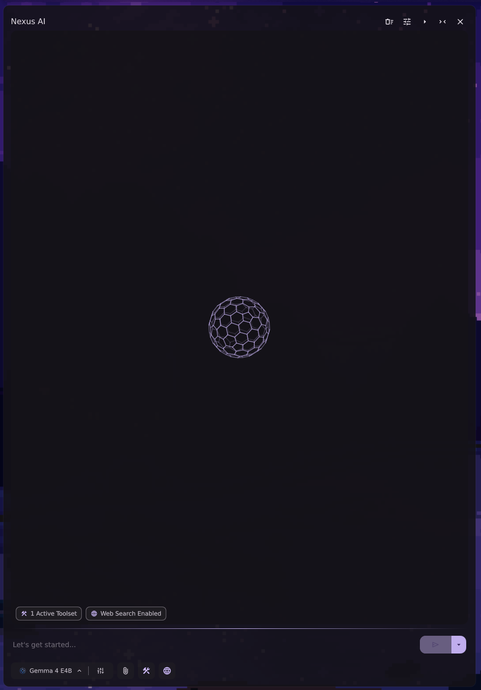
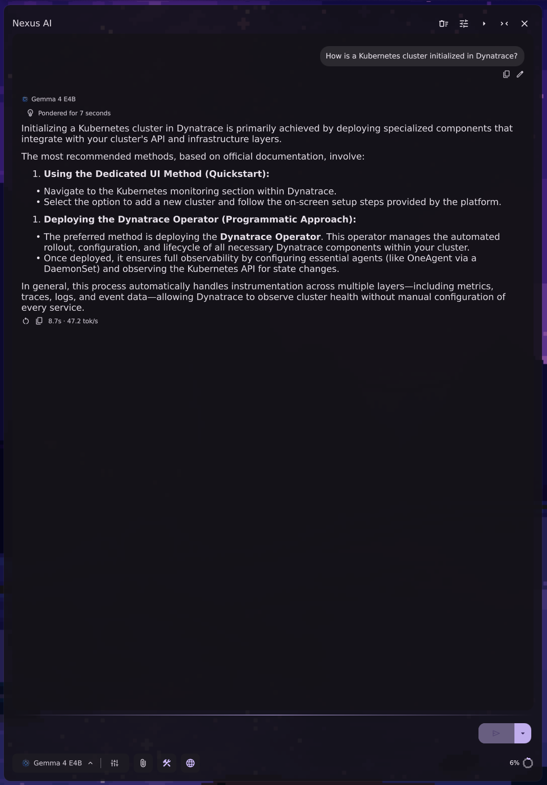
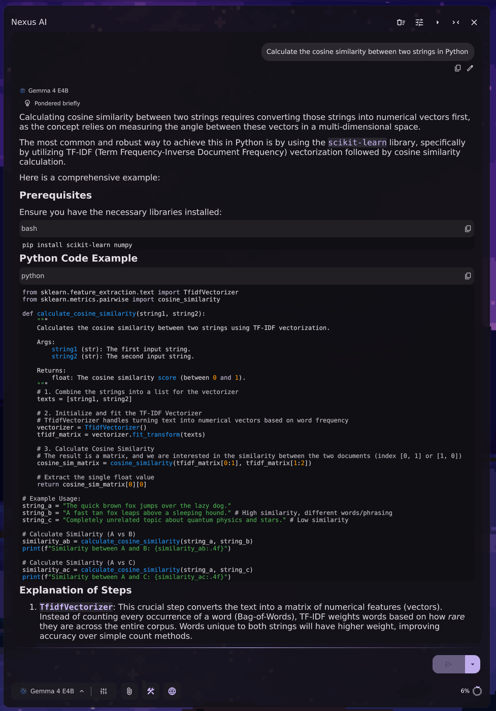
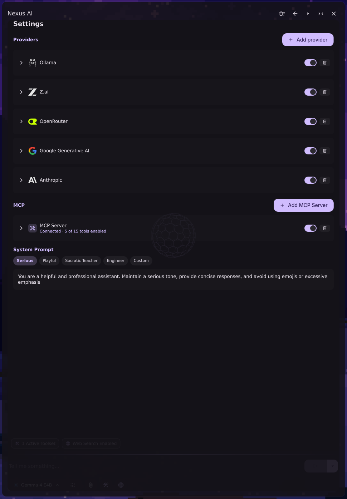

# Nexus AI DMS

AI assistant plugin for [DankMaterialShell](https://github.com/AvengeMedia/DankMaterialShell), made with love and care.

| Chat | Rich live markdown | Settings |
|-|-|-|
| |  | 

## Usage
- Toggle the plugin: `dms ipc call plugins toggle nexusAi`
## Features
- **Multi-Provider Ready:** Connect to standard cloud APIs or local providers.
- **Vision Support:** Models with vision can be used with image attachments, even from clipboard
- **Native Web Search:** Built-in zero-config web search with DuckDuckGo, as well as webpage fetch
- **MCP Support:** Full Model Context Protocol (MCP) tool integration with per-tool toggling.
- **Bells and whistles:** All the pretty things that our eyes like, or that we enjoy when bored

## Requirements
- `curl`
- That's it, you probably already have them

## Roadmap

- Multiple formats attachment (txt, pdf etc..)
- erm... I'll think about it along the way
- Ok fine, agentic capabilities with bash support

## ❤️ Gratitude
Thanks to the following tools developing this project is possible:
- models.dev
- lobehub.com